# Machine learning with Graphs
## Graph Structure

1. 图可以用来表示两种结构：
   1. Networks(AKA Natural Graphs) : 底层本来就是图结构
      - Social networks : 人与人之间关系的集合
      - Communication and transactions : Electronic devices, phone cells, fincacial transactions 点与点之间建立联系，联系中有信息
      - Biomedicine : Interaction between genes/proteins regulate life
      - Brain connections : Our thoughts are hidden in the connections between billions of neurons
   2. Graph(as a representations) : 存在 关系结构
     ，可以用图来建模关系结构。不是天然的图，但天然可以用图来建模
      - Information/knewledge : organized and linked : organized and linked
      - Software （不太懂为啥）
      
      - Similarity networks : connect similar data points
      - Realational Structures : Molecules, Scene graphs, 3D shapes, Particle-based() physics simulations 
2. Modern ML Toolbox is designed for simple sequences(NLP,Speech) and grids(CV)
   
   grid本质上还是二维或者说是高维的sequence
   
   squence,grid有 固定的拓扑结构
    ，都可以实现固定大小。sequence直接截就行，grid可以拉伸压缩等

   但是对于**图**:
   1. 任意大小和复杂拓扑
    ：
        i.e. : 没有**空间局部性(spatial locality)**:sequence有左右的概念，grid有上下左右
    1. 没有参考点，没有固定的遍历顺序
    2. 动态的，并且具有多个模态的特征
3. 传统ML中，**feature engineering**占用很多精力。图神经网络就是一种**表示学习**，自动学习图的良好表示，用于下游算法，跳过feature engineering的过程。

   
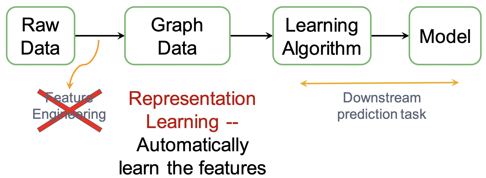

4. 图的**表示学习**就是将图上的点映射为d维嵌入。相似的点的嵌入也应该紧密。

   
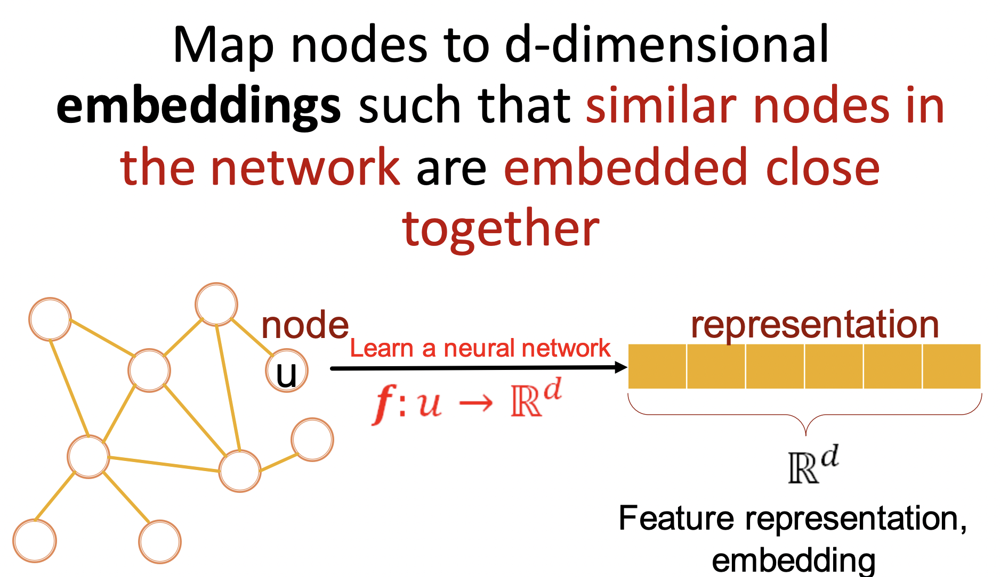

# Differernt types of tasks
图上的任务大概有4种：点➡️边➡️子图➡️全图

   
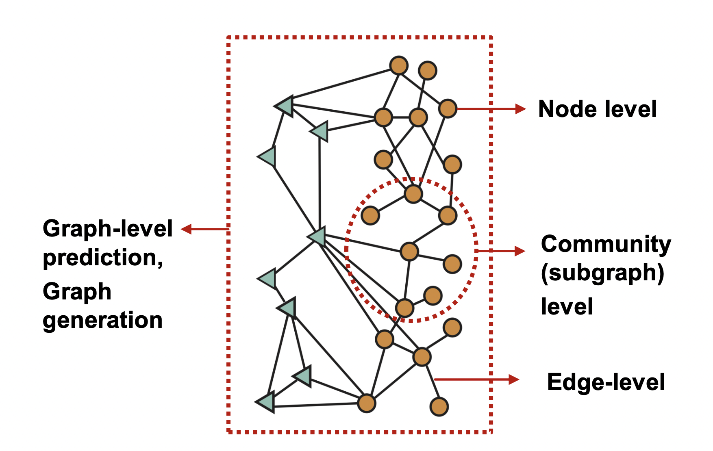

一些经典的图上的任务 
- 点分类：预测点的属性 <u>分类在线用户/商品</u>
- 边预测：预测两个点之间是否有缺失的边 <u>知识图谱补全</u>
- 图分类：<u>Molecule property prediction</u>
- 聚类：<u>Social circle detection</u>
- 图生成：<u>Drug discovery</u>
- 图进化：<u>Physical simulation(物理模拟)</u>

## Node-Level ML Tasks
根据氨基酸序列预测3D结构：Alphafold 
- Key idea: "Spatial graph"
  - Nodes:Amino acids in a protein sequence
  - Edges:Proximity between amino acids (residues)

   
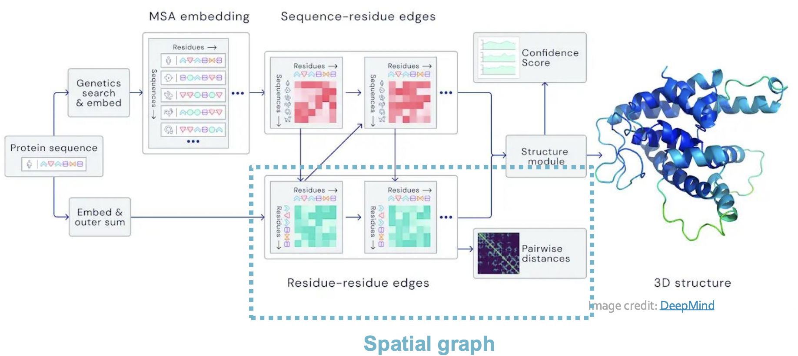

预测3D结构不是在预测边，不要搞混了，是在预测 点的位置。另外，Alphafold并非是建立了一个GNN，而是借鉴了GNN的MPNN的思想，也就是“Spatial graph”

## Edge-level ML Tasks

1. 推荐系统
   - Nodes: Users and items
   - Edges: User-item interactions
   
   
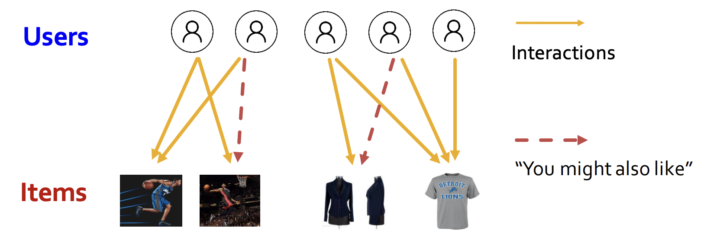

   注意这是一个  二分图 ， 边只存在user和item之间，user与user之间，item与item之间，是没有边的。<u>（如果存在边，这三种边的性质肯定是不同的，就成了异构图）</u>
   
   PinSage:Graph-based Recommender
   - Task:Learn node embedding $z_i$ such that  
      $d(z_{cake1},z_{cake2})<d(z_{cake1},z_{sweater})$
   
   
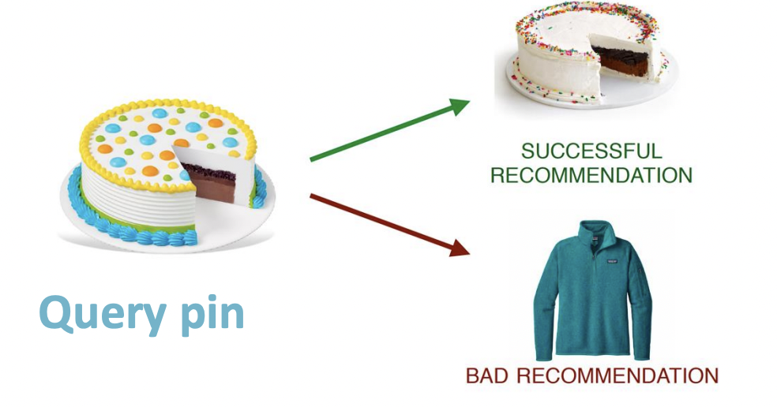

   <u>"相似的点的嵌入也应该紧密"</u>
   - Model:一个二分图，顶部是图像，底部是用户/Pintaest。图像会根据底层聚合在一起,在底层定义一个NN，让图片之间进行交互，得到新的嵌入。 
   图像的原始表示➡️底层网络交互➡️新的表示 
   以只考虑图片本身强很多。 
  
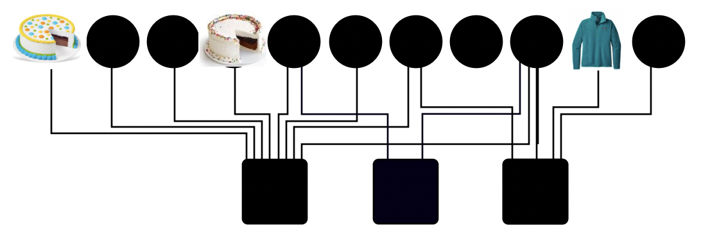

2. Drug Side Effects 
   同时服用多种药物，药物之间可能会发生反应，产生副作用。但是不同的药物对太多了,不能临床或实­验出结果,所以希望能够直接预­测。
   - Task:Given a pair of drugs predict adverse side effects
   - Nodes:Drugs & Proteins
   - Edge:Interactions
  
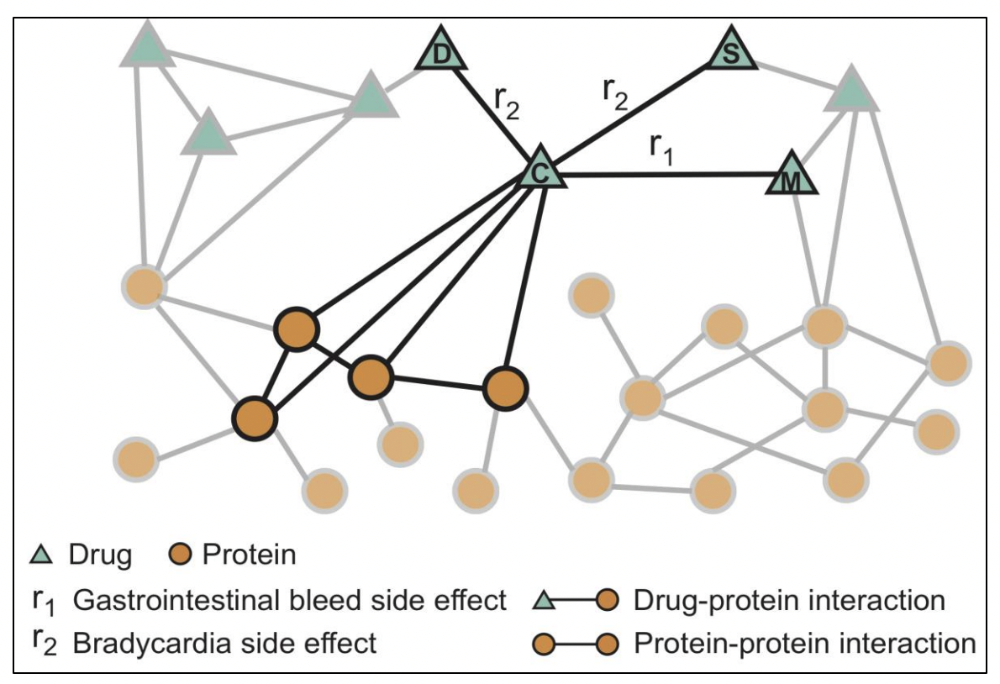

  
  抅建两个异构图
   - 药物与药物之间：边表示已知的副作用。这个图有很多 缺失的连接,是不完­整的。
   - 蛋白质与蛋白质之间 (蛋白质相互作用网络,或者叫inter-rectum)：<u>不是一个由氨基酸构成的蛋白质图,而是蛋白质与蛋白质之间的图,边表示哪些蛋白质会相互作用。</u>
   - 蛋白质与药物的边表示药物作用于哪些蛋白质。
  
 
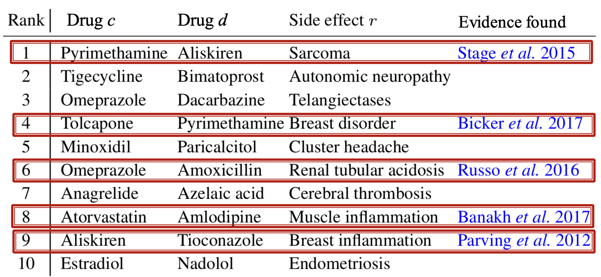

 
 选取可能性最高的10个预测, 都是没有出现在FDA的官方目录里面的。去查找文献来判断是否有存在证据,其中5个都找到了。

 <u>这个例子实际上就是对于边的分类任务。预测可能是哪种副作用，各种副作用的概率是多少。</u>
  
## Subgraph-level ML Tasks

Traffic Prediction（导航）
- Nodes:Road segments
- Edges
:Connectivity between road segments
- **Prediction**:Time of Arrival(ETA)

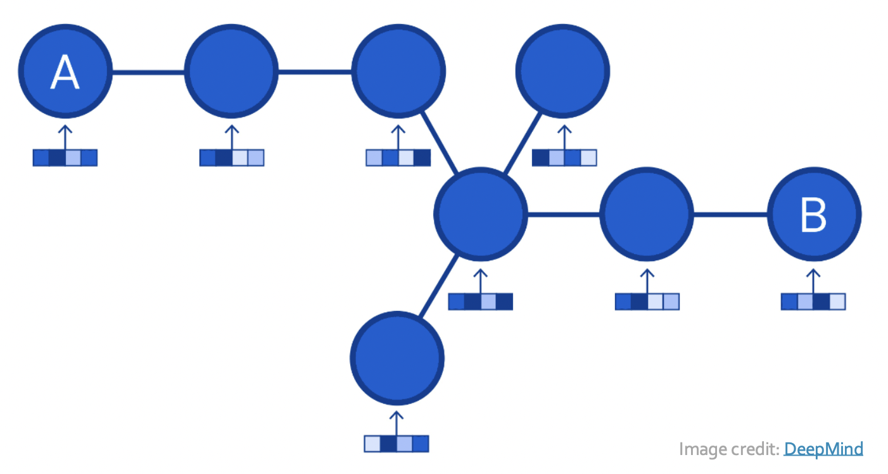

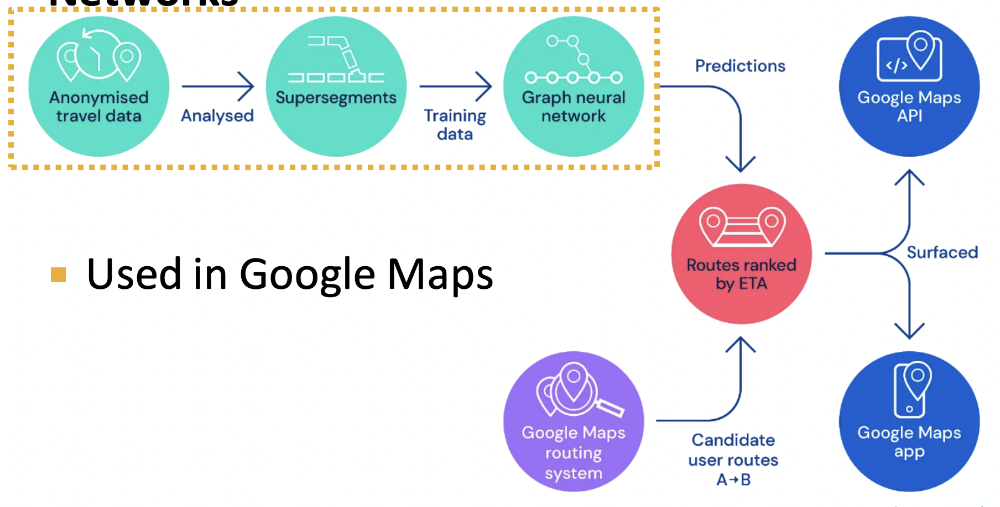

## Grpah-level MN Tasks

1. Drug discovery（图分类）
   - Antibiotics(抗生素) discovery
     - Nodes:Atoms
     - Edges:Chemical bonds 
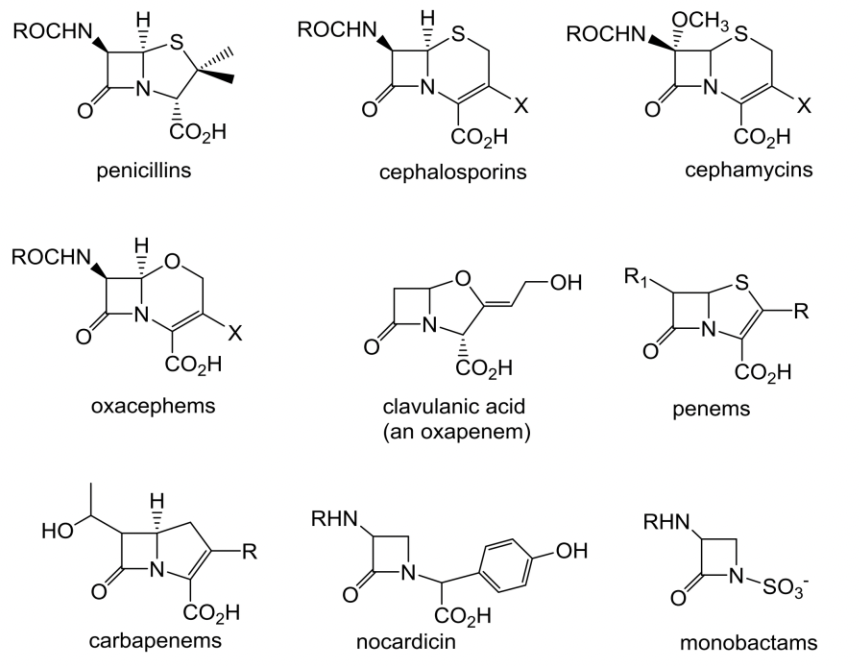

   - <u>并不是图生成，是一个图分类任务，从候选的大量分子中判断出有抗生素性质的分子</u>
  
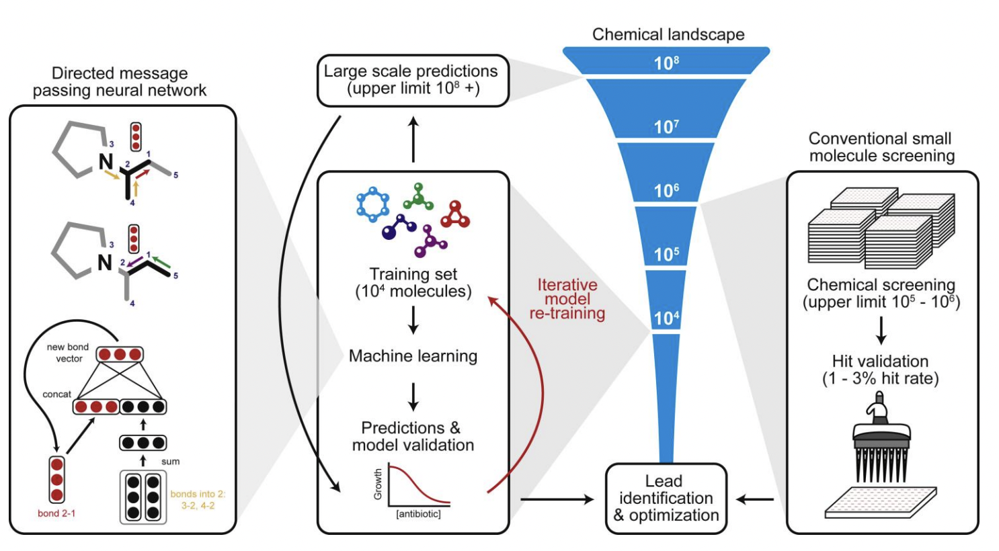

  最左边的框是GNN的MPNN的简化图，是说怎么更新边向量的。最上面表示从node2这边，用3-2，4-2这两条边更新2-1这一条边。中间表示从node1这边，用5-1更新1-2（2-1和1-2是一条边）。最下面的图是具体计算方式。这整个框就是右边Machine learning的细节。
  
  中间沙漏代表分子数的数量级，上限不低于 $10^{8}$ 。
  
  沙漏右边的图像代表传统的分子筛选方法。最多是在 $10^{5} - 10^{6} $ 量级上进行筛选，命中率在1-3%，最后再去鉴别和优化。
  
  沙漏左边的代表是ML方法。用 $10^{4}$量级的分子作为训练集，不断迭代训练，最后可以对 $10^{8}$ 量级的分子进行预测和验证，最后再去鉴别和优化。

  由此可见，**ML方法大大提高了分子筛选的上界**。
   
2. 图生成/优化
   - 生成新的分子

# Choice of a graph representation