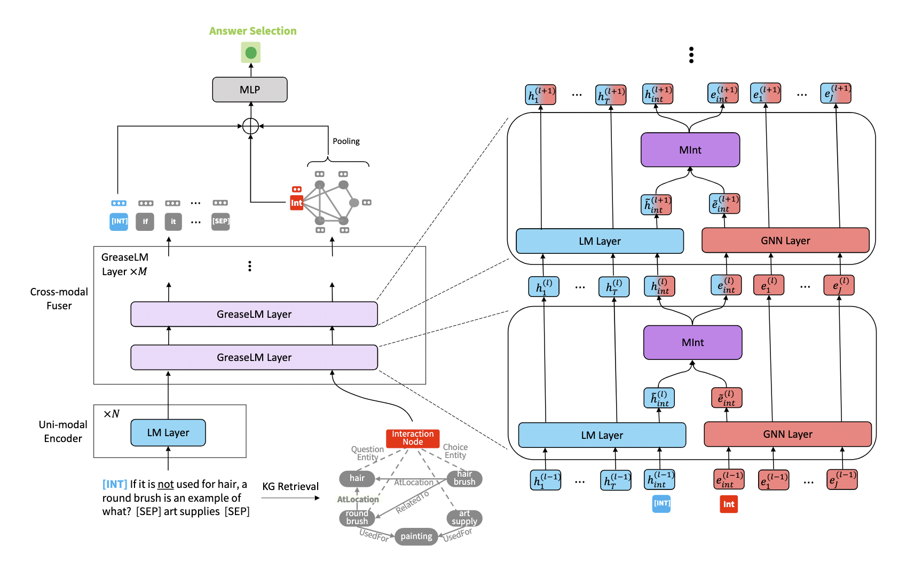

>本文是Christopher D. Manning和Jure Leskovec合作的一篇文章，NLPer和GNNer应该对这两个名字不陌生，一个讲了CS224N，一个讲了CS224W。

本文提出一种用图推理增强QA上的LM的架构：GREASE LM。GREASE LM通过对LM和GNN进行多层次深度交互，有效捕捉导GNN的结构信息与LM的语义约束，从而实现模型在QA任务上获得性能提升，提升处理复杂问题的能力。

## 研究背景

回答文本相关的问题需要从陈述的上下文(**context**)和它背后的知识(**knowledge**)来推理。

QA任务的基本范式是pre-trained LM。尽管在普通的benchmark上表现良好，但是当用于测试的example的分布与精调的数据集不相同时，模型的表现会变的挣扎。因为这种学习方式希望通过简单(偶尔是错误)的模式匹配直接走捷径获得答案，虽然能从LM中捕捉到context的情景约束和细微差别，但不能很好的表达概念之间的潜在关系。我们希望能用context提供的显性信息和内在的隐性知识来进行健壮的、结构化的推理。

Knowledge Graph(KG)由描述实体关系的三元组构成，被认为蕴含有大量的知识，在QA之类的推理任务上作用显著，因此用KG给LM扩充知识的结构化表示成为热门问题。然而，要将KG的推理优势扩展到一般的QA(问题和答案用自然语言表示，并且不容易转换成严格的逻辑查询)，需要根据QA example提供的信息和约束找到KG中正确的知识集成。

早期LM+KG的工作通常将两种模态在浅层并且以非交互的方式融合，比如各自独立编码最后预测时再融合，或者用一个模态去加强另一个模态的输入。一般分为三种：  
1. 双塔结构，没有交互;
2. KG支撑LM，比如用KG的编码来增强QA example的文本表示;
3. 第三种是LM支撑KG，用文本表示(LM的最后一层)去增强从example提取的KG。  

这三种结构信息流动最多有一个方向。这样两种模态信息交互的能力有限，需要进行深层次的融合来模拟结构化的情景推理。最近的一些工作探讨了这两种模态更深层次的集成。有的通过在结构化的KG数据上训练LM来将隐层知识编码进LM，然后用LM去生成针对QA的小KG。但是这样KG在转化成文本之后结构信息就丢掉了。QA-GNN用消息传递来联合更新LM和GNN，但是他们将LM池化作为整个架构的文本组件，限制了文本表示的更新。还有一些工作在预训练的时候将KG融入到LM中，但是模态的交互方向更多是将知识送到语言中。 Sun的工作与GREASE LM相似，但是它交互的bottleneck需要高精度的实体链接；并且LM和KG的参数共享限制了表达能力。

## 模型架构

**符号定义**:  
MCQA(multiple choice question answering)的数据集包括上下文段落 $c$ ，问题 $q$ ，答案候选集 $A$ ，都以文本的形式表示。本工作中，还假设有额外的知识图谱 $G$ 提供背景知识。  
给定QA example  $(c,q,A)$ 和KG $G$ ，判断正确的答案 $a \in A$ 。  
我们将自然语言中的token序列表示为 $\{w_1,\dots,w_T \}$ ，其中 $T$ 表示token数量，token  $w_t$  在 $l$ -th layer的表示为 $h_t^{(l)}$ 。KG的点集表示为 $\{e_1,\dots,e_J\}$ ，其中 $J$ 表示节点的数量。节点 $e_j$ 在 $l$ -th layer的表示为  $e_j^{(l)}$ 。

**输入表示**：
先将 $c,q,a$ 和分离符并起来作为模型输入 $[c;q;a]$ ,转换成token序列 $\{w_1,\dots,w_T \}$ ;然后用输入序列去检索(retrieval)出 $G$ 的子图 $G_{sub}$ , $G_{sub}$ 提供跟QA example相关的知识. $G_{sub}$ 的点集表示为 $\{e_1,\dots,e_J\}$ .

## Abstract

回答文本叙述相关的问题需要从陈述的上下文(context)和它背后的知识(knowledge)来推理.现在QA所用的预训练语言模型(pre-trained language model),虽然能捕捉到提供情景约束和细微差别的上下文,但不能很好的表达概念之间的潜在关系.即便使用知识图谱(KG)给LM扩充知识的结构化表示,但是如何将KG和contex融合和推理是一个还没解决的问题.本文提出了GREASELM,它用多层的模态交互操作来融合pretrained LM和GNN的编码.每个模态可以将信息传递给对方,从而使contex的表示以结构化的知识为基础,并让知识的图表示获得语意的细微差别(否定,模糊).在CommonsenseQA和OpenbookQA以及MedQA-USMLE三个benchmarks上,GREASELM的答案都更加可靠,甚至高于参数量8倍大的模型.

## Introduction

现在QA的基本范式是在一个大规模的语料上预训练,然后在QA数据集上微调.尽管在普通的benchmark上有很好的表现,但是当给定的例子的分布与精调的数据集不相同时,模型就很挣扎.因为这种学习方式希望通过简单(偶尔是错误)的模式直接走捷径获得答案,而不是用context提供的显性信息和内在的隐性知识来进行健壮的、结构化的推理.

另一方面,KG通过捕捉实体关系的三元组含有大量的知识,在结构化推理和QA中有重要作用.然而,要将KG的推理优势扩展到一般的QA(问题和答案用自然语言表示，并且不容易转换成严格的逻辑查询),需要根据QA example提供的信息和约束找到KG中正确的知识集成。之前的一些方法通常将两种模态在浅层并且以非交互的方式融合,比如独立编码最后预测时再融合,或者用一个模态去加强另一个模态的输入.这样两种模态交互信息的能力有限,如何进行深层次的融合来模拟结构化的情景推理成为一个问题.

GREASELM通过每层的深度集成,能够在一个统一的框架下对context和KG实体进行联合推理,而不依赖于特定的LM或GNN,因此这两种模态都可以由另一种模态进行语境化。

GREASELM在3个不同领域(不同的知识,不同的KG):CommonsenseQA, OpenbookQA, MedQA-USMLE比大小接近的传统QA模型提高5.5%,6.6%,1.3%;比LM+KG的模型高0.9%,1.8%,0.5%. 此外,由于这两种模态的深度融合,GREASELM在有细微语义差别的问题上表现出了强大的性能，解决了多种限制,比如否定和模糊。

## Related Work
早期LM+KG的工作一般有三种:第一种是双塔结构,没有交互;第二种KG支撑LM,比如用KG的编码来增强QA example的文本表示;第三种是LM支撑KG,用文本表示(LM的最后一层)去增强从example提取的KG.这三种信息流动最多一个方向.

最近的一些工作探讨了这两种模态更深层次的集成.有的通过在结构化的KG数据上训练将隐层知识编码进LM,然后用LM去生成针对QA的小KG.但是LM训练完KG就扔了,丢失了重要的结构信息.QA-GNN用消息传递来联合更新LM和GNN,但是他们将LM池化作为整个架构的文本组件,限制了文本表示的更新.

不同与以往的工作,我们对LM做独立的token表示,对KG做对立的node表示,然后将他们在很多层混合,从而让每个模态的表示能反映出另一模态的特殊性质(知识作为语言的基础,语意区分重要的和不重要的知识).同时,我们也保留了各自的独立结构,这样的保留经验证能大大改善QA的性能.

还有一些工作在预训练的时候将KG融入到LM中,但是相比于GREASELM的多层融合,模态的交互更多是将知识送到语言中.有一个相似的工作,但是它交互的触发不同,需要高精度的实体使用范围链接;并且共享LM和KG的参数限制了表达能力.

## Proposed Approach:GREASELM
有两个堆叠组件:
1. 单模态的LM层:获得输入token的初始表示,N层
2. 交叉模态的GREASELM层:将LM层的文本表示与KG的图表示融合在一起,M层  

MCQA(multiple choice question answering)的数据集包括上下文段落 $c$ ,问题 $q$ ,答案候选集 $A$ ,都以文本的形式表示.本工作中,还假设有额外的知识图谱 $G$ 提供背景知识.

**符号定义**:  
给定QA example  $(c,q,A)$ 和KG $G$ ,判断正确的答案 $a \in A$  .  
我们将自然语言中的token序列表示为 $\{w_1,\dots,w_T \}$ ,其中 $T$ 表示token数量,token  $w_t$  在 $l$ -th layer的表示为 $h_t^{(l)}$ .KG的点集表示为 $\{e_1,\dots,e_J\}$ ,其中 $J$ 表示节点的数量.节点 $e_j$ 在 $l$ -th layer的表示为  $e_j^{(l)}$ .

### 输入表示

先将 $c,q,a$ 和分离符并起来作为模型输入 $[c;q;a]$ ,转换成token序列 $\{w_1,\dots,w_T \}$ ;然后用输入序列去检索(retrieval)出 $G$ 的子图 $G_{sub}$ , $G_{sub}$ 提供跟QA example相关的知识. $G_{sub}$ 的点集表示为 $\{e_1,\dots,e_J\}$ .

**KG Retrieval**:  

首先根据实体从 $G$ 中链接出一个初始点集 $V_{linked}$ .然后将 $V_{linked}$ 中任意点对之间的2-hop路径(长度为2,也就是中间只有一个点,也就是桥点)的桥点加进去形成 $V_{retrieved}$ .然后再对 $V_{retrieved}$ 里的点计算相关分数(relevance score):将node name并在QA example后面,通过LM得到node name的output score,作为relavance score.我们取 $V_{retrieved}$ 中分数最高的200个点为 $V_{sub}$ ,剩下的都扔掉.最后,将所有链接两个 $V_{sub}$ 中的点的边加进去形成  $G_{sub}$ .另外, $G_{sub}$ 里的每个点都有一个类型,标记这个点对应的实体是从哪里来的,来自上下文 $c$ ,询问 $q$ ,答案 $a$ 或者是这些点的相邻节点.本文之后的KG都是表示 $G_{sub}$ .

**Interaction Bottlenecks**:  

定义用于交互的 *interaction token* $w_{int}$ 和 *interaction node* $e_{int}$ ,作为两个模态交互的bottlenecks.将 $w_{int}$ 添加到token序列里面,将 $e_{int}$ 链接 $G_{sub}$ 中点集 $V_{link}$ .(不是 $G_{sub}$ 所有点)

### Language Pre-Encoding
将 $\{w_1,\dots,w_T \}$ 的token、段、位置潜入求和作为 $l=0$ 时的表示 $\{h_{int}^{(0)},h_1^{(0)},\dots,h_T^{(0)}\}$ .之后就用LM-layer运算出每一层的表示.LM-layer的参数初始为预训练的结果.

$$\{h_{int}^{(l)},h_1^{(l)},\dots,h_T^{(l)}\}=LM-layer(\{h_{int}^{(l-1)},h_1^{(l-1)},\dots,h_T^{(l-1)}\}) \\
for \ \  l=1,\dots,N $$

### GREASELM

GREASELM layer有三个组成部分:
1. transformer LM encoder
2. GNN
3. MInt